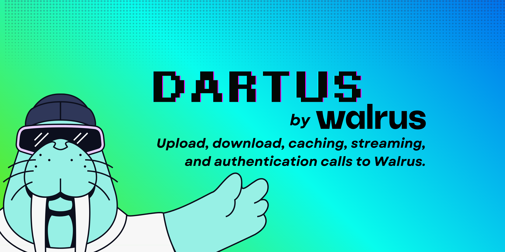

# Dartus



**Dartus** is a Dart SDK for [Walrus](https://walrus.xyz) decentralized blob storage.

## Features

- **Upload**: `putBlob`, `putBlobFromFile`, `putBlobStreaming` with optional epochs, deletable flag (defaults to `true`), and SUI object routing
- **Download**: `getBlob`, `getBlobByObjectId`, `getBlobAsFile`, `getBlobAsFileStreaming` with automatic caching
- **Metadata**: `getBlobMetadata` for HEAD requests returning response headers
- **Caching**: Disk-based LRU cache with SHA-256 filenames, configurable size limits
- **Auth**: JWT support via instance-level or per-call tokens
- **TLS**: Configurable validation (insecure mode for testnet, secure for mainnet)
- **Logging**: Built-in console logging with `none`, `basic`, and `verbose` levels

## Installation

### From pub.dev

```yaml
dependencies:
  dartus: ^0.1.0
```

### From source

```yaml
dependencies:
  dartus:
    git:
      url: https://github.com/Immadominion/Dartus.git
```

Then run:

```bash
dart pub get  # or flutter pub get
```

## Quick Start

```dart
import 'package:dartus/dartus.dart';
import 'dart:io';

void main() async {
  final client = WalrusClient(
    publisherBaseUrl: Uri.parse('https://publisher.walrus-testnet.walrus.space'),
    aggregatorBaseUrl: Uri.parse('https://aggregator.walrus-testnet.walrus.space'),
    useSecureConnection: true, // use TLS for production
  );

  // Upload blob
  final imageBytes = await File('image.png').readAsBytes();
  final response = await client.putBlob(data: imageBytes);
  print('Uploaded: $response');

  // Extract blob ID from response
  final blobId = response['newlyCreated']?['blobObject']?['blobId'] 
      ?? response['alreadyCertified']?['blobId'];

  // Download blob (cached automatically)
  final downloaded = await client.getBlob(blobId);
  print('Downloaded ${downloaded.length} bytes');

  await client.close();
}
```

## Documentation

Generate API documentation locally:

```bash
dart doc
dart pub global activate dhttpd
dart pub global run dhttpd --path doc/api
```

Then open `http://localhost:8080` in your browser.

Published packages have API docs automatically generated at `pub.dev/documentation/dartus/latest`.

## API Reference

### WalrusClient

```dart
WalrusClient({
  required Uri publisherBaseUrl,
  required Uri aggregatorBaseUrl,
  Duration timeout = const Duration(seconds: 30),
  Directory? cacheDirectory,
  int cacheMaxSize = 100,
  bool useSecureConnection = false,
  String? jwtToken,
  HttpClient? httpClient,
  WalrusLogLevel logLevel = WalrusLogLevel.basic,
})
```

**Upload Methods**

- `putBlob({required Uint8List data, ...})` - Upload in-memory bytes
- `putBlobFromFile({required File file, ...})` - Upload from file path
- `putBlobStreaming({required File file, ...})` - Stream large file uploads

**Download Methods**

- `getBlob(String blobId)` - Download with caching
- `getBlobByObjectId(String objectId)` - Download without caching
- `getBlobAsFile({required String blobId, required File destination})` - Save to file
- `getBlobAsFileStreaming({...})` - Stream download with progress
- `getBlobMetadata(String blobId)` - Fetch headers via HEAD request

**Auth Methods**

- `setJwtToken(String token)` - Set instance-level JWT
- `clearJwtToken()` - Remove instance-level JWT

**Logging Methods**

- `setLogLevel(WalrusLogLevel level)` - Control console output
- `logInfo(String message)`, `logVerbose(...)`, `logWarning(...)`, `logError(...)`

## TLS Configuration

**Testnet** (expired/self-signed certificates):

```dart
final client = WalrusClient(
  publisherBaseUrl: Uri.parse('https://publisher.testnet.walrus.com'),
  aggregatorBaseUrl: Uri.parse('https://agg.test.walrus.eosusa.io'),
  useSecureConnection: false, // default
);
```

**Mainnet** (valid certificates):

```dart
final client = WalrusClient(
  publisherBaseUrl: Uri.parse('https://publisher.walrus.com'),
  aggregatorBaseUrl: Uri.parse('https://aggregator.walrus.com'),
  useSecureConnection: true,
);
```

## Testing

```bash
# Run all tests (unit + live integration)
dart test

# Run specific test suite
dart test test/blob_cache_test.dart

# Code analysis
dart analyze

# Format code
dart format .
```

## Flutter Demo

A reference Flutter app lives in `example/`:

```bash
cd example
flutter pub get
flutter run
```

Features:

- Upload images via picker
- Fetch blobs by ID
- Console logging output

## Requirements

- Dart SDK ≥ 3.9.2 or Flutter SDK ≥ 3.35.0
- Publisher and aggregator endpoints for your Walrus deployment
- iOS: ATS exceptions for insecure HTTP (testnet only)

## Storage Costs (SUI & WAL)

Dartus is an HTTP client. It does **not** handle SUI gas or WAL tokens directly.

| Component | Who Pays | What Happens |
|-----------|----------|---------------|
| **Publisher** | Publisher operator | Pays SUI gas + WAL for storage |
| **Aggregator** | Free | Reads are free, no tokens needed |
| **Dartus SDK** | Nothing | Pure HTTP—no wallet integration |

**Testnet**: Public publishers (e.g., `publisher.walrus-testnet.walrus.space`) subsidize costs. Free for developers.

**Mainnet**: No free public publishers. Options:

1. Run your own publisher with a funded Sui wallet
2. Use an authenticated publisher service
3. Wait for sponsored storage solutions

This design keeps Flutter/Dart apps simple—no Sui wallet SDK needed on the client.

## License

MIT License - see [LICENSE](LICENSE) for details.

## Links

- [Walrus Documentation](https://docs.wal.app)
- [Issue Tracker](https://github.com/Immadominion/Dartus/issues)
- [Changelog](CHANGELOG.md)
