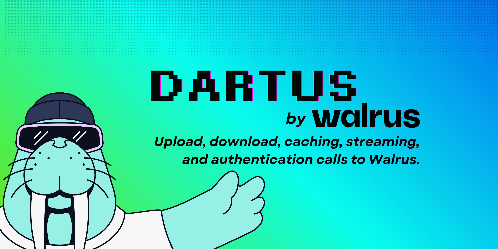

# Dartus



[](https://pub.dev/packages/dartus)
[](https://pub.dev/packages/dartus/score)
[](LICENSE)

**Dartus** is a Dart/Flutter SDK for [Walrus](https://walrus.xyz) decentralized blob storage. It provides three operational modes — from simple HTTP uploads to full client-side erasure coding with wallet-signed transactions.

## SDK Overview

Dartus supports three modes, each building on the previous:

| Mode | Class | Who Pays | Dependencies | Use Case |
|------|-------|----------|--------------|----------|
| **HTTP** | `WalrusClient` | Publisher operator (SUI+WAL) | None (HTTP only) | Simple apps, server-side |
| **Relay** | `WalrusDirectClient` + upload relay | User's wallet | `sui` package | dApps with wallet signing |
| **Direct** | `WalrusDirectClient` | User's wallet | `sui` + Rust FFI | Full control, best performance |

**HTTP mode** sends blobs to a publisher/aggregator over HTTP. The publisher operator covers storage costs. This is the simplest integration — no wallet required.

**Relay mode** encodes blobs via an upload relay server, then the user signs the Sui transaction with their wallet. The user pays storage costs directly.

**Direct mode** performs client-side erasure coding using Rust FFI (`libwalrus_ffi`), writes slivers directly to storage nodes, and builds/signs Sui transactions. This gives full control and the best performance but requires the native library.

## Features

- **HTTP uploads**: `putBlob`, `putBlobFromFile`, `putBlobStreaming`
- **HTTP downloads**: `getBlob`, `getBlobByObjectId`, `getBlobAsFile` with automatic disk caching
- **Direct reads**: `readBlob`, `getSlivers`, `getBlobMetadata`, `getVerifiedBlobStatus` from storage nodes
- **Direct writes**: `writeBlob`, `writeFiles`, `writeQuilt` with client-side encoding
- **Step-by-step flows**: `WriteBlobFlow`, `WriteFilesFlow` for dApp wallet integration (encode → register → upload → certify)
- **Quilt support**: Pack multiple files into a single blob with `encodeQuilt` / `QuiltReader`
- **File abstractions**: `WalrusFile`, `WalrusBlob` with `.bytes()`, `.text()`, `.json()`, `.files()`
- **Upload relay**: `UploadRelayClient` with configurable tip strategies (const/linear)
- **On-chain ops**: `registerBlobTransaction`, `certifyBlobTransaction`, `deleteBlobTransaction`
- **On-chain reads**: `getOwnedBlobs`, `getBlobObjectInfo`, `readBlobAttributes`, `writeBlobAttributes`
- **Storage costs**: `storageCost(size, epochs)` for cost estimation
- **Error hierarchy**: 18+ typed errors with retry semantics (`RetryableWalrusClientError`)
- **Caching**: Disk-based LRU cache with SHA-256 filenames, configurable size limits
- **Auth**: JWT support via instance-level or per-call tokens
- **TLS**: Configurable certificate validation
- **Logging**: Three-level console logging (`none`, `basic`, `verbose`)
- **Network presets**: `WalrusNetwork.testnet` / `WalrusNetwork.mainnet` with pre-configured package IDs
- **BLS12-381**: Cryptographic operations via [`bls_dart`](https://pub.dev/packages/bls_dart)

## Installation

Add Dartus to your `pubspec.yaml`:

```yaml
dependencies:
  dartus: ^0.2.0
```

For direct mode (wallet-signed transactions), also add the Sui SDK:

```yaml
dependencies:
  dartus: ^0.2.0
  sui: ^0.3.7
```

Then install:

```bash
dart pub get  # or: flutter pub get
```

### Native library setup (direct mode only)

Direct mode requires `libwalrus_ffi` for client-side erasure coding. Build it from the included Rust crate:

```bash
# Prerequisites: Rust toolchain (https://rustup.rs)
cd Dartus/native
./build.sh release
```

The library loads automatically from standard paths. To override the search:

```bash
export WALRUS_FFI_LIB=/path/to/libwalrus_ffi.dylib
```

Without the native library, the encoder falls back to a pure-Dart implementation. The fallback works for testing but produces incompatible blob IDs — the upload relay and storage nodes will reject uploads encoded with it.

## Quick Start — HTTP Mode

```dart
import 'package:dartus/dartus.dart';
import 'dart:io';

void main() async {
  final client = WalrusClient(
    publisherBaseUrl: Uri.parse('https://publisher.walrus-testnet.walrus.space'),
    aggregatorBaseUrl: Uri.parse('https://aggregator.walrus-testnet.walrus.space'),
    useSecureConnection: true,
  );

  // Upload
  final imageBytes = await File('photo.png').readAsBytes();
  final response = await client.putBlob(data: imageBytes);
  final blobId = response['newlyCreated']?['blobObject']?['blobId']
      ?? response['alreadyCertified']?['blobId'];
  print('Uploaded: $blobId');

  // Download (cached automatically on subsequent calls)
  final data = await client.getBlob(blobId);
  print('Downloaded ${data.length} bytes');

  await client.close();
}
```

## Quick Start — Direct Mode

```dart
import 'package:dartus/dartus.dart';
import 'package:sui/sui.dart';

void main() async {
  // Create a direct client from a network preset
  final client = WalrusDirectClient.fromNetwork(
    network: WalrusNetwork.testnet,
  );

  // Read a blob by its base64 blob ID
  final data = await client.readBlob(blobId: 'wAtcbEtCYyCX2gPcAv6z...');
  print('Read ${data.length} bytes');

  // Or get a high-level WalrusBlob handle
  final blob = await client.getBlob(blobId: 'wAtcbEtCYyCX2gPcAv6z...');
  final file = await blob.asFile();
  print('File: ${await file.text()}');

  client.close();
}
```

## Writing Blobs (Direct Mode)

### Simple write

```dart
final signer = SuiAccount.fromMnemonics(mnemonics, SignatureScheme.Ed25519);

final result = await client.writeBlob(
  blob: utf8.encode('Hello Walrus!'),
  epochs: 3,
  signer: signer,
  deletable: true,
);

print('Blob ID: ${result.blobId}');
print('Object ID: ${result.blobObjectId}');
```

### Step-by-step flow (for dApp wallets)

When the signer is a browser wallet, use the flow API to separate encoding from signing:

```dart
// 1. Encode (no wallet needed)
final flow = await client.writeBlobFlow(
  blob: utf8.encode('Hello Walrus!'),
);
await flow.encode();

// 2. Register (returns a Transaction for wallet signing)
final registerTx = flow.register(WriteBlobFlowRegisterOptions(
  epochs: 3,
  signer: walletAddress,
  deletable: true,
));
// Sign & execute registerTx with the user's wallet...

// 3. Upload slivers to storage nodes
await flow.upload(WriteBlobFlowUploadOptions(
  registerResult: registerResult,
));

// 4. Certify (returns a Transaction for wallet signing)
final certifyTx = flow.certify();
// Sign & execute certifyTx...
```

## Writing Files & Quilts

Pack multiple files into a single quilt blob:

```dart
final files = [
  WalrusFile.from(utf8.encode('Hello'), identifier: 'hello.txt'),
  WalrusFile.from(utf8.encode('World'), identifier: 'world.txt'),
];

final results = await client.writeFiles(
  files: files,
  epochs: 3,
  signer: signer,
  deletable: true,
);

for (final r in results) {
  print('${r.identifier}: blobId=${r.blobId}');
}
```

Read a quilt:

```dart
final blob = await client.getBlob(blobId: quiltBlobId);
final files = await blob.files();
for (final file in files) {
  final name = await file.getIdentifier();
  final text = await file.text();
  print('$name: $text');
}
```

## Upload Relay

Use an upload relay when you want the server to handle erasure coding but the user to pay:

```dart
final client = WalrusDirectClient.fromNetwork(
  network: WalrusNetwork.testnet,
  // Upload relay is auto-configured for testnet.
  // To override or add a max tip:
  uploadRelay: UploadRelayConfig(
    host: 'https://upload-relay.testnet.walrus.space',
    maxTip: BigInt.from(1000), // max tip in MIST
  ),
);
```

## Error Handling

Dartus provides a typed error hierarchy matching the TS SDK:

```dart
try {
  final data = await client.readBlob(blobId: blobId);
} on BlobNotCertifiedError {
  print('Blob was registered but never certified by storage nodes');
} on NotEnoughSliversReceivedError {
  // Retryable — reset cached state and retry
  client.reset();
  final data = await client.readBlob(blobId: blobId);
} on BehindCurrentEpochError {
  client.reset(); // Refresh epoch state, then retry
} on StorageNodeConnectionError catch (e) {
  print('Storage node unreachable: $e');
} on WalrusClientError catch (e) {
  print('Client error: $e');
}
```

**Retryable errors** extend `RetryableWalrusClientError`. After catching one, call `client.reset()` to refresh cached committee/epoch state, then retry.

### Error Classes

| Error | Retryable | Description |
|-------|-----------|-------------|
| `WalrusClientError` | — | Base error class |
| `RetryableWalrusClientError` | Yes | Base retryable error |
| `NoBlobMetadataReceivedError` | Yes | No metadata from any node |
| `NotEnoughSliversReceivedError` | Yes | Insufficient slivers for decoding |
| `NotEnoughBlobConfirmationsError` | Yes | Insufficient write confirmations |
| `BehindCurrentEpochError` | Yes | Client behind current epoch |
| `BlobNotCertifiedError` | Yes | Blob not yet certified |
| `NoBlobStatusReceivedError` | No | No storage node returned status |
| `InconsistentBlobError` | No | Blob encoded incorrectly |
| `InsufficientWalBalanceError` | No | Not enough WAL tokens |
| `BlobBlockedError` | No | Blob blocked by quorum |
| `StorageNodeApiError` | — | Base storage-node HTTP error |
| `BadRequestError` | No | 400 — malformed request |
| `NotFoundError` | No | 404 — blob/sliver not found |
| `AuthenticationError` | No | 401/403 — auth failure |
| `RateLimitError` | Yes | 429 — rate limited |
| `InternalServerError` | Yes | 500 — storage-node error |

## API Reference

### `WalrusClient` (HTTP Mode)

```dart
WalrusClient({
  required Uri publisherBaseUrl,
  required Uri aggregatorBaseUrl,
  Duration timeout = const Duration(seconds: 30),
  Directory? cacheDirectory,
  int cacheMaxSize = 100,
  bool useSecureConnection = false,
  String? jwtToken,
  WalrusLogLevel logLevel = WalrusLogLevel.basic,
})
```

| Method | Description |
|--------|-------------|
| `putBlob({data, epochs?, deletable?, ...})` | Upload bytes |
| `putBlobFromFile({file, ...})` | Upload from file |
| `putBlobStreaming({file, ...})` | Stream large uploads |
| `getBlob(blobId)` | Download with caching |
| `getBlobByObjectId(objectId)` | Download by Sui object ID |
| `getBlobAsFile({blobId, destination})` | Save to file |
| `getBlobMetadata(blobId)` | Get response headers |
| `setJwtToken(token)` / `clearJwtToken()` | JWT auth |
| `setLogLevel(level)` | Adjust logging verbosity |
| `close()` | Release HTTP client and cache resources |

### `WalrusDirectClient` (Direct Mode)

```dart
WalrusDirectClient.fromNetwork(
  network: WalrusNetwork.testnet, // or .mainnet
  uploadRelayConfig: ...,        // optional relay config
)
```

| Method | Description |
|--------|-------------|
| `readBlob({blobId})` | Read & decode from storage nodes |
| `getBlob({blobId})` | Get a `WalrusBlob` handle |
| `getFiles({ids})` | Read files by blob/quilt ID |
| `writeBlob({blob, epochs, signer, ...})` | Full write flow |
| `writeFiles({files, epochs, signer, ...})` | Write files as quilt |
| `writeBlobFlow({blob})` | Step-by-step write |
| `writeFilesFlow({files})` | Step-by-step quilt write |
| `getBlobMetadata({blobId})` | Metadata from storage nodes |
| `getSlivers({blobId})` | Raw slivers from storage nodes |
| `getVerifiedBlobStatus({blobId})` | Quorum-verified blob status |
| `getBlobObjectInfo({objectId})` | On-chain blob info |
| `resolveBlobId(id)` | Resolve `0x...` → base64 blob ID |
| `getOwnedBlobs({owner})` | List wallet's blob objects |
| `storageCost(size, epochs)` | Calculate storage cost |
| `registerBlobTransaction(...)` | Build register transaction |
| `certifyBlobTransaction(...)` | Build certify transaction |
| `deleteBlobTransaction(...)` | Build delete transaction |
| `readBlobAttributes(...)` | Read on-chain attributes |
| `writeBlobAttributes(...)` | Write on-chain attributes |
| `reset()` | Refresh cached epoch/committee state |
| `close()` | Release all resources |

### `WalrusFile` & `WalrusBlob`

```dart
// Create a file for upload
final file = WalrusFile.from(
  utf8.encode('Hello, World!'),
  identifier: 'hello.txt',
  tags: {'type': 'text'},
);

// Read from a blob handle
final blob = await client.getBlob(blobId: id);
final data = await blob.bytes();       // raw bytes
final text = await blob.text();         // UTF-8 string
final json = await blob.json();         // decoded JSON
final asFile = await blob.asFile();     // WalrusFile handle

// Read quilt files
final files = await blob.files();       // list of WalrusFile
for (final f in files) {
  print('${await f.getIdentifier()}: ${await f.text()}');
}
```

### Utility Functions

| Function | Description |
|----------|-------------|
| `blobIdFromInt(BigInt)` | Numeric blob ID → URL-safe base64 |
| `blobIdToInt(String)` | URL-safe base64 → BigInt |
| `encodeQuilt(blobs)` | Encode multiple blobs into quilt format |
| `computeBlobId(rootHash, unencodedLength, encodingType)` | Compute blob ID from encoding metadata |

## TLS Configuration

```dart
// Testnet (some community endpoints use self-signed certs)
final client = WalrusClient(
  publisherBaseUrl: Uri.parse('https://publisher.walrus-testnet.walrus.space'),
  aggregatorBaseUrl: Uri.parse('https://aggregator.walrus-testnet.walrus.space'),
  useSecureConnection: false, // accepts any certificate
);

// Production — use your own publisher/aggregator or an authenticated service
final client = WalrusClient(
  publisherBaseUrl: Uri.parse('https://your-publisher.example.com'),
  aggregatorBaseUrl: Uri.parse('https://your-aggregator.example.com'),
  useSecureConnection: true, // enforce TLS validation
);
```

> **Warning**: `useSecureConnection: false` disables certificate validation entirely. Only use for testnet or local development.

## Storage Costs

| Mode | Who Pays | How |
|------|----------|-----|
| **HTTP** (`WalrusClient`) | Publisher operator | Operator's wallet covers SUI gas + WAL |
| **Direct** (`WalrusDirectClient`) | User's wallet | User signs transactions, pays SUI gas + WAL |
| **Aggregator reads** | Free | No tokens needed |

Use `client.storageCost(size, epochs)` to estimate WAL cost before writing:

```dart
final cost = await client.storageCost(1024 * 1024, 3); // 1 MB for 3 epochs
print('Storage: ${cost.storageCost} WAL');
print('Write:   ${cost.writeCost} WAL');
print('Total:   ${cost.totalCost} WAL');
```

**Testnet** — Public publishers subsidize costs. Free for developers.  
**Mainnet** — Run your own publisher, use an authenticated service, or use direct mode with a funded wallet.

## Testing

```bash
cd Dartus

# Run all tests (395+)
dart test

# Specific suite
dart test test/blob_cache_test.dart

# Verbose output
dart test --reporter expanded

# Static analysis (strict mode)
dart analyze --fatal-infos

# Format check
dart format --set-exit-if-changed .
```

## Example Apps

### In-package example

A Flutter demo app lives in `example/`:

```bash
cd Dartus/example
flutter pub get
flutter run -d macos  # or: flutter run -d ios / android
```

Demonstrates HTTP-mode upload and download with `WalrusClient`.

### Showcase app (full demo)

A comprehensive Flutter app showcasing all SDK features is available in the [Dartus-Demo](https://github.com/Immadominion/Dartus-Demo) repository:

- HTTP uploads & downloads
- Direct-mode reads & writes
- Wallet creation & faucet
- Blob inspection & metadata
- Quilt reading
- Transaction builder
- Encoding & BLS operations
- System state viewer

## Requirements

| Requirement | Version |
|-------------|---------|
| Dart SDK | >= 3.9.2 |
| Flutter SDK | >= 3.35.0 (for Flutter projects) |
| `sui` package | ^0.3.7 (direct mode only) |
| Rust toolchain | Latest stable (native library only) |

**HTTP mode** has no additional requirements beyond Dart.  
**Direct mode** requires the `sui` package and optionally the Rust-built `libwalrus_ffi` for client-side encoding.

For iOS apps using testnet HTTP endpoints, add ATS exceptions to `Info.plist`.

## API Documentation

Full generated API docs are available on pub.dev:

- [pub.dev/documentation/dartus/latest](https://pub.dev/documentation/dartus/latest/)

Generate locally:

```bash
dart doc
# Then open doc/api/index.html
```

## License

MIT — see [LICENSE](LICENSE).

## Links

- [Walrus Protocol](https://walrus.xyz)
- [Walrus Documentation](https://docs.wal.app)
- [pub.dev Package](https://pub.dev/packages/dartus)
- [API Reference](https://pub.dev/documentation/dartus/latest/)
- [Issue Tracker](https://github.com/Immadominion/Dartus/issues)
- [Changelog](CHANGELOG.md)
- [TypeScript SDK](https://github.com/MystenLabs/ts-sdks/tree/main/packages/walrus)
